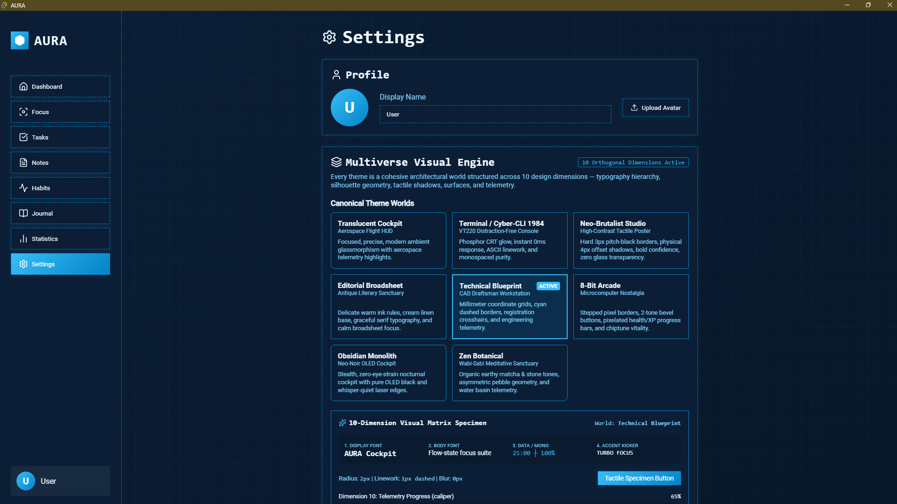
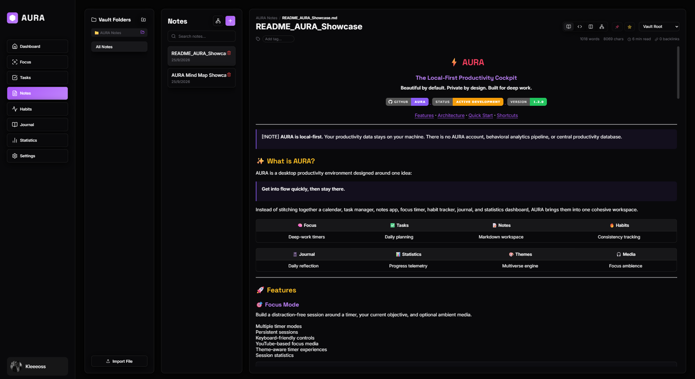
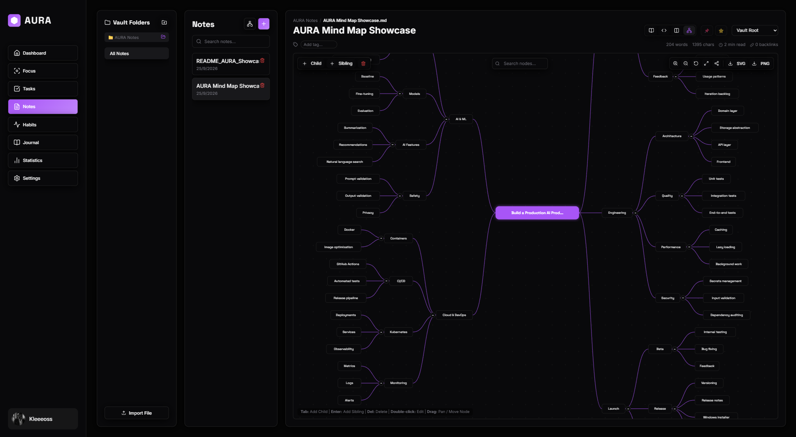
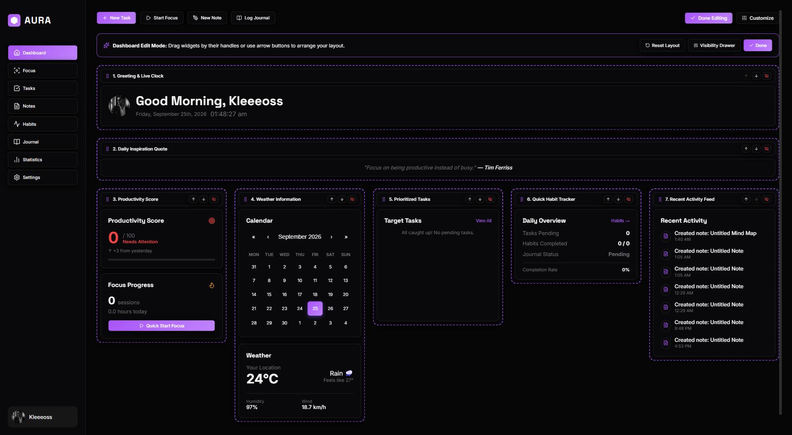
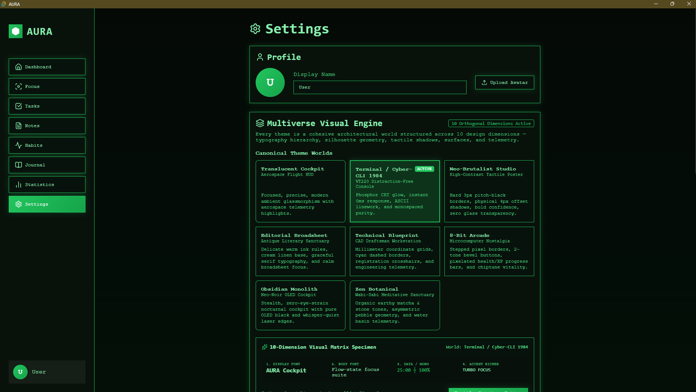
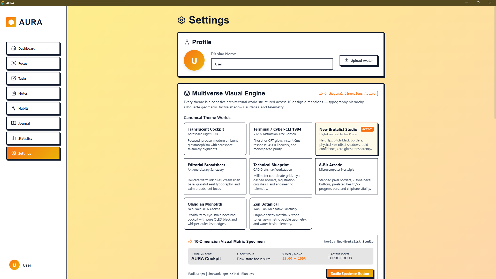
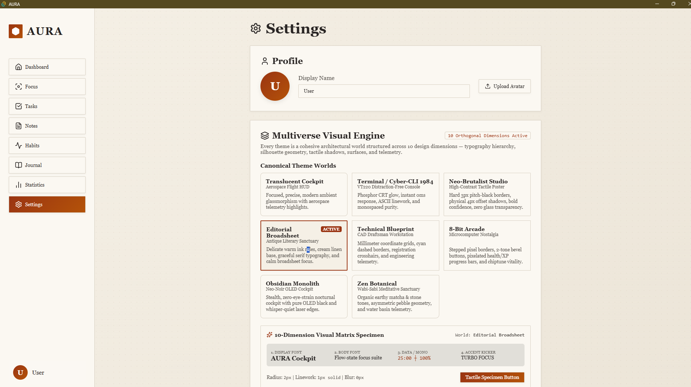
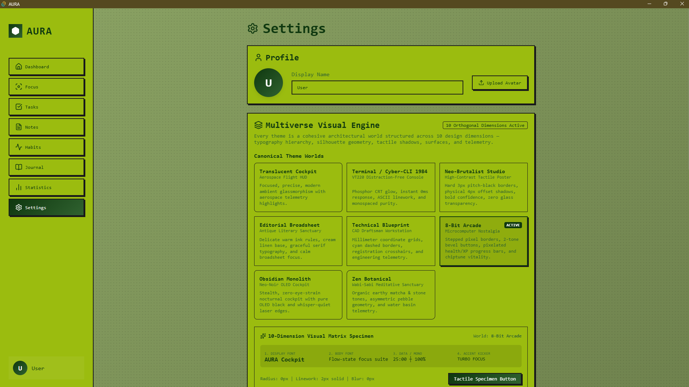
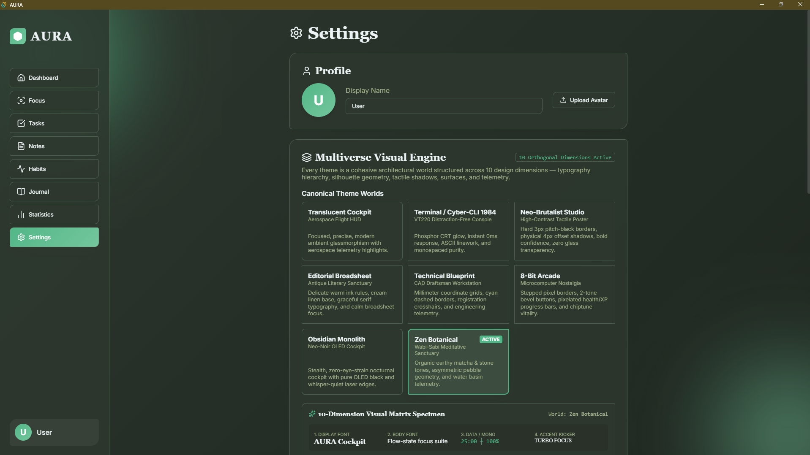
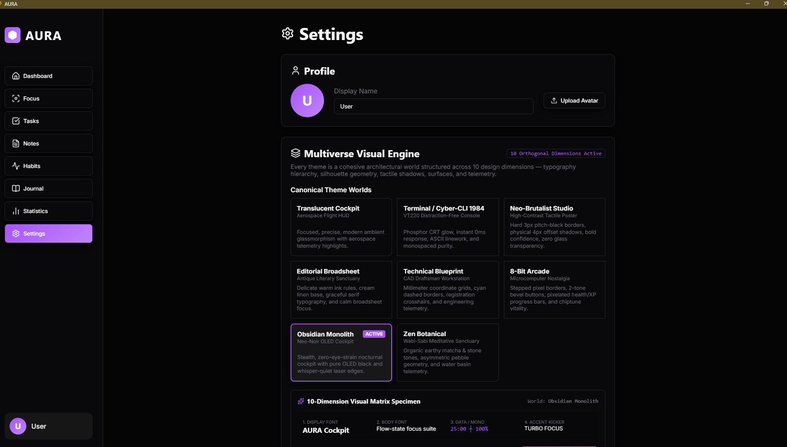

<div align="center">

  

  # AURA
  ### *The Glassmorphic Desktop Productivity Suite, Local-First Knowledge Vault & Multiverse Visual Engine*

  [](https://react.dev/)
  [](https://tauri.app/)
  [](https://www.typescriptlang.org/)
  [](./LICENSE)

  **A modern, hyper-focused desktop productivity suite crafted with frosted glassmorphism, mathematical audio synthesis, a connected productivity loop, local-first markdown knowledge vault, interactive mind maps, and the revolutionary Multiverse Visual Engine.**

  [Downloads](#-downloads--installation) • [Local Markdown Vault](#-local-first-markdown-vault--tri-mode-editor) • [Mind Map Extension](#-interactive-mind-map-extension) • [Dashboard Edit Mode](#-drag-and-drop-dashboard-edit-mode) • [Multiverse Visual Engine](#-multiverse-visual-engine) • [The Vibe Coding Story](#-the-vibe-coding-case-study) • [Features](#-features) • [Architecture](#-desktop-architecture-matrix) • [Local Development](#-local-development)

</div>

---

<div align="center">
  
</div>

---

## ⚡ Downloads & Installation

AURA is available as an ultra-lightweight native Windows desktop application built on **Tauri v2** using native OS WebView2 (under 10 MB bundle size, instant startup, minimal RAM).

👉 **[Download the Latest Windows Release (v1.2.0)](https://github.com/kleeeoss/aura-productivity-suite/releases/latest)**

| Asset | Format | Description |
| :--- | :--- | :--- |
| **[`AURA_1.2.0_x64-setup.exe`](https://github.com/kleeeoss/aura-productivity-suite/releases/download/v1.2.0/AURA_1.2.0_x64-setup.exe)** | NSIS Installer | **Recommended.** Windows installer with desktop and start menu shortcuts. |
| **[`AURA_standalone.exe`](https://github.com/kleeeoss/aura-productivity-suite/releases/download/v1.2.0/AURA_standalone.exe)** | Portable | Zero-install portable binary. Run directly from anywhere or a USB drive. |

---

## 📚 Local-First Markdown Vault & Tri-Mode Editor

AURA 1.2 elevates personal knowledge management into a true **local-first, zero-telemetry markdown vault**. Your data belongs exclusively to you: standard `.md` files residing on your local filesystem serve as the single source of truth, completely eliminating cloud lock-in, latency, and remote tracking.

<div align="center">
  
  <p><em>Tri-Mode CodeMirror 6 Workspace: Split-view editor featuring real-time KaTeX math rendering, YAML frontmatter, nested folder hierarchy, tag pills, and wiki-link traversal.</em></p>
</div>

### 🔑 Key Vault Architecture & Capabilities:
- **Plain `.md` Single Source of Truth**: Notes are saved directly to disk as standard Markdown files with structured YAML frontmatter (`tags`, `aliases`, `created`, `updatedAt`). Open, edit, or version your vault effortlessly with external tools like Obsidian, VS Code, or Git.
- **Hardware-Level Atomic File Writes**: Managed via Tauri v2 native Rust IPC (`IVaultDriver`), file saving executes through atomic staging (`.tmp` write followed by atomic rename) to eliminate write collisions and protect against power-cut corruption.
- **Defensive Trash Protocol**: Deleting a note moves it safely into an internal `.trash/` directory instead of performing irreversible destructive unlinks.
- **Real-Time Rust File Watcher**: A debounced filesystem watcher (`notify-debouncer-mini` in Rust) observes the vault directory and dispatches live update events directly into the UI. Modifications from external editors appear instantaneously without manual reloading.
- **CodeMirror 6 Tri-Mode Editor**:
  - **Reading Mode**: Clean, distraction-free rendered view for reading, studying, and reviewing documents.
  - **Source Mode**: Full-power Markdown coding environment with line numbers, active line highlight, bracket matching, and folding.
  - **Split Mode**: Synchronized, dual-pane layout allowing simultaneous editing and live preview.
- **Offline KaTeX Mathematical Rendering**: Full mathematical formula compilation for inline (`$...$`) and display (`$$...$$`) TeX expressions. All TeX math fonts and styling are bundled locally offline—zero external CDNs or network calls.
- **Interactive Task Checkboxes**: GitHub-style checklist items (`- [ ]` and `- [x]`) are fully interactive in preview mode; ticking a checkbox updates the underlying `.md` file in-place.
- **Raw HTML & Strict Layout Containment**: Safely renders GitHub README-style markup (`<kbd>`, `<details>`, `<table>`, `<div align="center">`) with CSS containment (`contain: paint layout`) and responsive table scroll wrappers to prevent horizontal layout overflow.
- **Wiki-Links & Backlink Discovery**: Deep-link across thoughts with `[[Note Title]]` or `[[Note Title|Custom Alias]]`. Clickable pills instantly navigate to target notes, complete with backlink indexing across the entire vault.

---

## 🧠 Interactive Mind Map Extension

Visual thinking meets structural documentation. AURA 1.2 introduces the **Notes Mind Map Extension**, transforming hierarchical Markdown outlines into dynamic, interactive knowledge graphs with real-time bi-directional synchronization.

<div align="center">
  
  <p><em>Interactive Mind Map Canvas: Bi-directional markdown-to-graph visualization with collision-free radial hierarchy, interactive pan/zoom, node drag positioning, and wiki-link deep-linking.</em></p>
</div>

### 🌐 Mind Map Features:
- **Bi-Directional Outline Parsing**: Headings (`#`, `##`, `###`) and nested bullet lists automatically construct parent-child node relationships. Edits made in the editor instantaneously update the visual mind map, and structural node manipulations synchronize back to clean Markdown.
- **Collision-Free Layout Engine**: Purpose-built radial and hierarchical placement algorithms compute dynamic bounding boxes, leaf branch clearances, and branch angles to guarantee crisp, overlap-free diagrams.
- **Interactive SVG Canvas**: Infinite fluid canvas with high-performance mousewheel zooming, drag panning, draggable node coordinates, and collapsible parent nodes.
- **Wiki-Link Integration**: Direct navigation from mind map nodes to linked markdown notes with a single click.

---

## 🎛 Drag-and-Drop Dashboard Edit Mode

Your productivity cockpit should match your cognitive workflow. AURA 1.2 introduces **Live Dashboard Edit Mode**, empowering users to reorder and configure dashboard cards with tactile drag-and-drop mechanics powered by `@dnd-kit`.

<div align="center">
  
  <p><em>Live Cockpit Customizer: Drag-and-drop widget reordering powered by @dnd-kit, instant visibility toggles, and persistent workspace configurations.</em></p>
</div>

### 🛠 Customization Options:
- **Tactile Drag-and-Drop Reordering**: Grab widget handles to shift cards up, down, or across columns with smooth layout animations and physical drop feedback.
- **Granular Module Toggles**: Independently show or hide any of the 8 core cockpit modules: Live Clock, Weather, Daily Calendar, Habits, Tasks, Recent Activity Feed, Productivity Score, and Motivational Quotes.
- **Instant Persistence & Canonical Reset**: Layout configurations persist automatically to local state, with a one-click "Reset Layout" button to instantly restore the default balance.

---

## 🌌 Multiverse Visual Engine

AURA features the **Multiverse Visual Engine**—a fundamental shift away from cosmetic color swaps into **complete architectural worldbuilding**. Every theme is a cohesive environment structured across **10 orthogonal design dimensions**, an expressive **4-tier typography hierarchy**, and **theme-adaptive Markdown design tokens**.

### 📐 The 10 Orthogonal Dimensions

| # | Dimension | Role & Implementation |
| :-: | :--- | :--- |
| **1** | **Theme World** | Overarching artistic philosophy, lineage, and emotional atmosphere. |
| **2** | **Typography System** | 4-tier functional typographic roles: Display, Body, Data/Mono, and Accent/Kicker. |
| **3** | **Component Shapes** | Distinct silhouette geometry: 0px razor chamfers, 14px cockpit rounds, to `18px 6px` asymmetric wabi-sabi pebbles. |
| **4** | **Borders & Linework** | Aerospace 1px hairlines, 1px dashed cyan CAD guidelines, 2px stepped pixel borders, or 3px pitch-black borders. |
| **5** | **Shadows & Depth** | Refractive frosted glass blurs, physical 4px offset sticker shadows, CRT phosphor glow, to zero-shadow flat linen. |
| **6** | **Surfaces & Textures** | Authentic material overlays: CRT scanlines, CAD coordinate millimeter grids, book linen, and Game Boy dot matrices. |
| **7** | **Spacing & Density** | Calibrated information density: compact telemetry cockpits, balanced desks, and expansive reading broadsheets. |
| **8** | **Motion Dynamics** | Custom physics: instant 0ms VT220 steps, 60ms 2-frame chiptune steps, snappy 100ms brutalist snaps, to 400ms gentle easing. |
| **9** | **Interaction Feedback** | Tactile visual responses: physical button depressions (`translate(2px, 2px)`), phosphor blooming, and laser edge illuminates. |
| **10** | **Telemetry & Progress** | Bespoke geometric progress visualizations adapted to each theme world's mechanical personality. |

---

### 🪐 Canonical Theme Worlds

<div align="center">

| **Terminal / Cyber-CLI 1984** | **Neo-Brutalist Studio** |
| :---: | :---: |
|  |  |
| *VT220 Distraction-Free Console • Phosphor CRT glow • ASCII linework • 0ms instant steps* | *High-Contrast Tactile Poster • 3px solid black borders • Physical 4px offset drop-shadows* |

| **Editorial Broadsheet** | **8-Bit Arcade** |
| :---: | :---: |
|  |  |
| *Antique Literary Sanctuary • Delicate ink rules • Cream linen texture • Serif typography* | *Microcomputer Nostalgia • Game Boy 4-shade green • Stepped pixel borders • Chiptune vitality* |

| **Zen Botanical** | **Obsidian Monolith** |
| :---: | :---: |
|  |  |
| *Wabi-Sabi Meditative Sanctuary • Earthy matcha & stone • Asymmetric pebble geometry* | *Neo-Noir OLED Cockpit • Pure #000000 black • Stealth zero-eye-strain nocturnal laser edges* |

</div>

- **🛸 Translucent Cockpit**: Aerospace Flight HUD with glassmorphic deep-slate acrylics, Space Grotesk display typography, aerospace telemetry halos, and circular HUD arcs.
- **📐 Technical Blueprint**: CAD Draftsman Workstation featuring millimeter coordinate grids, cyan dashed borders, registration crosshairs, and engineering caliper telemetry (`CAL-065mm`).

---

### 🔤 4-Tier Typographic Hierarchy

AURA separates typography into four purposeful roles:
1. **Display Font**: Hero emblems, window titles, and view headers (e.g. *Archivo Black*, *Fraunces*, *Space Grotesk*, *VT323*, *Press Start 2P*).
2. **Body Font**: Long-form readability for notes, reflections, and task descriptions (e.g. *Inter*, *Merriweather*, *Plus Jakarta Sans*, *Fira Code*).
3. **Data / Mono Font**: Tabular numbers, timestamps, countdown clocks, and telemetry figures (e.g. *JetBrains Mono*, *Space Mono*, *Fira Code*).
4. **Accent / Kicker Font**: Subheadings, category badges, keyboard shortcuts, and button kickers.

---

### ⏱ Theme-Adaptive Focus & Telemetry

When working in the Focus Suite, your Pomodoro countdown progress automatically mirrors the mechanical personality of your active theme world:

- **Cyber-CLI**: Monospaced ASCII bracket meters `[██████░░░░] 60%`.
- **Neo-Brutalist**: Tactile 10-segment physical blocks with active fill.
- **8-Bit Arcade**: Retro video game health & XP bars `HP: [♥♥♥♡♡] 60%`.
- **Technical Blueprint**: Precision drafting caliper readouts `CAL-065mm`.
- **Obsidian Monolith**: Pulsing OLED laser rings.
- **Editorial Broadsheet**: Flowing ink sweeps.
- **Zen Botanical**: Concentric water basin ripples.
- **Translucent Cockpit**: Aerospace HUD orbital arcs.

---

## 🤖 The "Vibe Coding" Case Study

AURA is an honest, transparent case study in modern **spec-driven AI pair engineering** (colloquially known as *"vibe coding"*). 

Rather than a toy prototype generated in one prompt on a random afternoon, AURA was built through disciplined engineering iterations between:
- **Human Technical Director & Product Architect** (Prompting, high-level architecture decisions, quality assurance, manual edge-case hunting, user experience direction).
- **Gemini** (Autonomous implementation, code generation, refactoring, systems integration, build toolchain configuration).

### 🔍 Highlights from the Engineering Trenches:
1. **The Background Timer Drift Bug**: When minimized while coding or studying in Obsidian, Chromium and Windows aggressively throttle `setInterval`. A naive timer lost 90% of time. We refactored `useTimer.ts` into a **Timestamp Delta-Time Architecture** using `Date.now()` anchors to preserve microsecond accuracy regardless of window state.
2. **From Electron to Pure Tauri v2**: When Electron's 150MB bundle and memory footprint proved too heavy for a background companion app, we pivoted to **Rust / Tauri v2**, completely removing Electron and shrinking the binary size down to under 10MB while maintaining a shared web codebase and native OS performance.
3. **Procedural Web Audio Synthesis**: Replaced flat audio recordings with real-time mathematical noise generators (White, Pink, and Brownian noise) calculated directly through the Web Audio API.
4. **Responsive Transform Matrix**: Solved CSS viewport clipping and whitespace bugs across scaling levels (80% to 150%) via an anchored `transform: scale()` matrix.
5. **The Multiverse Visual Engine**: Evolved basic CSS styling into a comprehensive 10-dimension architectural matrix supporting 8 distinct canonical worlds with bespoke typography, surfaces, and telemetry.
6. **Local-First Markdown Vault & Zero-Telemetry Architecture**: When standard note apps relied on proprietary formats and cloud telemetry, we engineered a native Rust-backed vault driver directly over plain `.md` files. Paired with offline-bundled KaTeX math and local Google Fonts, AURA operates with 100% offline resilience and zero telemetry.

📖 **[Read the complete engineering changelog in `iterations.md`](./iterations.md)**

---

## ✨ Features

### 🏠 Home Dashboard
- **Drag-and-Drop Edit Mode**: Live cockpit customizer powered by `@dnd-kit` for intuitive card reordering and layout personalization.
- **Live Clock & Date**: Real-time localized time tracking with timezone-safe calendar alignment.
- **Resilient Weather Widget**: Instant response with 30-minute in-memory caching, 1.5s network timeout, and silent offline fallback.
- **Daily Calendar**: Interactive calendar view with date selection.
- **Productivity Score**: Dynamic algorithm scoring your daily task completion, focus sessions, and habits.
- **Recent Activity Feed**: Central event stream updating whenever work is logged anywhere in the application.
- **Motivational Engine**: Dynamic quotes that refresh across tabs.

### ⏱ Focus Suite (Pomodoro)
- **State-Persistent Timer**: Work, Short Break, and Long Break intervals that persist smoothly across tab navigation.
- **Background Drift Immunity**: Uses real-world timestamp deltas so timers never pause when AURA is out of focus.
- **Theme-Adaptive Telemetry**: Progress rings, ASCII brackets, caliper gauges, and 8-bit health bars that match your visual world.
- **Distraction-Free Focus Mode**: Fullscreen ambient mode with smooth backdrop dimming.
- **Interactive Audio Visualizer**: Live HTML5 Canvas waveform reacting to focus sessions.

### 🪐 Focus Spaces (Theme-Decoupled Workflow Presets)
- **Theme-Decoupled Personalization**: Switching focus spaces configures timers and ambient soundscapes without overriding your active Multiverse theme or custom accent colors.
- **Deep Code**: 50m hyperfocus sprint with deep brown noise and coding category logging.
- **Study Sprint**: 25m classic Pomodoro with balanced white noise.
- **Flow / Writing**: 45m distraction-free writing session with soft pink noise.
- **Instant Switching**: Toggle spaces in 1-click via the header pill or global shortcuts (`Ctrl+1`, `Ctrl+2`, `Ctrl+3`).

### 🎵 Media & Sound Suite
- **Embedded Media Player**: Paste any **Spotify** playlist/track URL or **YouTube** video/stream link to load a clean, integrated web player directly inside AURA.
- **Noise Generators**: Web Audio API procedural synthesis with individual volume sliders:
  - ⚪ **White Noise** (Uniform spectrum for noise cancellation)
  - 🌸 **Pink Noise** (Balanced 1/f falloff for reading & writing)
  - 🟤 **Brownian Noise** (Deep, low-frequency rumble for relaxation)

### 📚 Knowledge & Productivity Modules
- **Notes (Local Markdown Vault)**: Local-first `.md` file vault, YAML frontmatter, atomic writes, `.trash/` safety, and live Rust file watching.
- **CodeMirror 6 Tri-Mode Editor**: Reading, Source, and Split views with syntax highlighting and line numbers.
- **Mind Map Extension**: Bi-directional Markdown-to-graph visualization with collision-free radial hierarchy and interactive pan/zoom.
- **Offline Math & Rich Markdown**: Offline KaTeX math rendering, interactive checklist checkboxes, and GFM raw HTML support with layout containment.
- **Wiki-Links**: Bidirectional thought cross-referencing with `[[Note Title]]` syntax and backlink exploration.
- **Tasks**: Kanban-style task tracker with categories, priority tags, and focus time tracking.
- **Habits**: Daily habit tracker with calendar-accurate streak calculation and achievement unlocks.
- **Journal**: Daily reflection log with mood ratings and quick session recaps.
- **Statistics**: Real focus time breakdowns, category analytics, and 90-day activity heatmaps.

### 🎨 Personalization & Accessibility
- **8 Canonical Theme Worlds**: Translucent Cockpit, Cyber-CLI 1984, Neo-Brutalist Studio, Editorial Broadsheet, Technical Blueprint, 8-Bit Arcade, Obsidian Monolith, and Zen Botanical.
- **Markdown Semantic Tokens**: Headings, blockquotes, code blocks, tables, and math elements styled authentically per theme world.
- **10-Dimension Visual Matrix**: Inspect live font specimens, border metrics, tactile button states, and progress telemetry directly in Settings.
- **UI Scaling Slider**: Seamlessly scale the entire interface from **80% to 150%** without layout distortion.
- **Accessibility Toggles**: Reduce Motion and Disable Animations for low-spec machines.
- **Defensive Data Portability**: Full JSON database export and schema-validated backup import.

---

## 🏛 Desktop Architecture Matrix

AURA is configured with a unified build matrix targeting native Windows desktop and web:

| Feature | ⚡ Tauri v2 (Desktop) | 🌐 Web (Vite SPA) |
| :--- | :--- | :--- |
| **Output Location** | `Builds/Tauri/` | `Builds/Web/` |
| **Bundle Size** | **~5 – 10 MB** | ~1 MB |
| **RAM Footprint** | **~40 – 70 MB** | Dependent on Browser |
| **Engine** | Native Edge WebView2 + Rust | Standard Browser |
| **Installer** | NSIS Setup & Standalone | N/A (Static hosting) |

---

## 💻 Local Development

### Prerequisites
- [Node.js](https://nodejs.org/) (v18 or later)
- [Rust & Cargo](https://www.rust-lang.org/tools/install) (required for building the Tauri desktop app)

### Setup
1. **Clone the repository**:
   ```bash
   git clone https://github.com/kleeeoss/aura-productivity-suite.git
   cd aura-productivity-suite
   ```

2. **Install dependencies**:
   ```bash
   npm install
   ```

3. **Start local web dev server**:
   ```bash
   npm run dev
   ```

4. **Launch with Tauri (Desktop Development)**:
   ```bash
   npm run tauri dev
   ```

5. **Run Quality Gate Lint**:
   ```bash
   npm run lint
   ```

6. **Run Automated Test Suite**:
   ```bash
   npm test
   ```

7. **Verify Version Consistency**:
   ```bash
   npm run verify-version
   ```

### Building Releases
```bash
# Build the Web SPA (outputs to Builds/Web)
npm run dist:web

# Build the Tauri Windows Installer & Standalone (outputs to Builds/Tauri)
npm run dist:tauri

# Build all targets sequentially
npm run dist:all
```

---

## 🤝 Contributing & Bug Reports

Contributions, feature suggestions, and bug reports are warmly welcome!

- Found a bug or glitch? Feel free to [open an issue](https://github.com/kleeeoss/aura-productivity-suite/issues).
- Have an idea for a new widget or ambient generator? Start a discussion or submit a Pull Request.

---

## 📄 License

This project is licensed under the **MIT License** — see the [LICENSE](./LICENSE) file for details.
