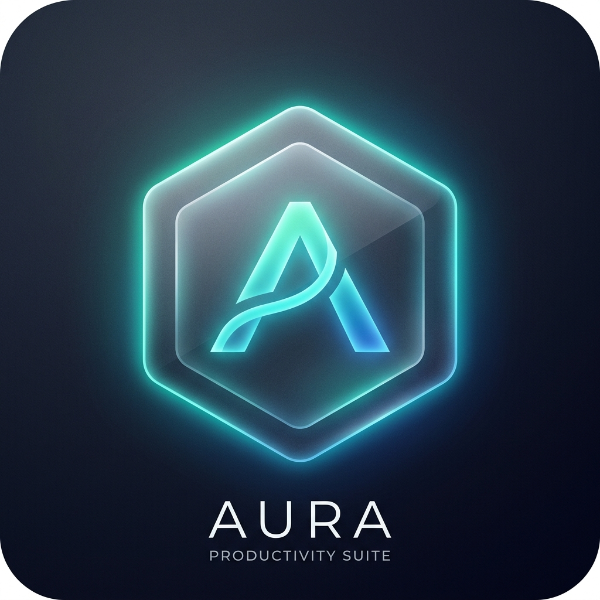
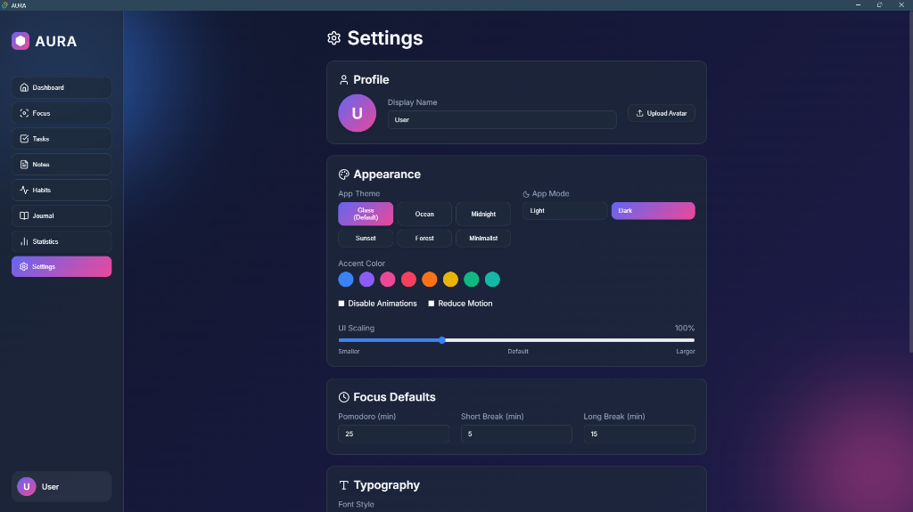

<div align="center">

  

  # AURA
  ### *The Glassmorphic Desktop Productivity Suite*

  [](https://react.dev/)
  [](https://tauri.app/)
  [](https://www.typescriptlang.org/)
  [](https://www.electronjs.org/)
  [](./LICENSE)

  **A modern, hyper-focused desktop productivity suite crafted with frosted glassmorphism, mathematical audio synthesis, and a synchronized state ecosystem.**

  [Downloads](#-downloads--installation) • [The Vibe Coding Story](#-the-vibe-coding-case-study) • [Features](#-features) • [Architecture](#-desktop-architecture-matrix) • [Local Development](#-local-development)

</div>

---

<div align="center">
  
</div>

---

## ⚡ Downloads & Installation

AURA is available as an ultra-lightweight native Windows executable built on **Tauri v2** using native OS WebView2 (under 10 MB bundle size, instant startup, minimal RAM).

👉 **[Download the Latest Windows Release (v1.0.0)](https://github.com/kleeeoss/aura-productivity-suite/releases/latest)**

| Asset | Format | Description |
| :--- | :--- | :--- |
| **[`AURA_0.1.0_x64-setup.exe`](https://github.com/kleeeoss/aura-productivity-suite/releases/download/v1.0.0/AURA_0.1.0_x64-setup.exe)** | NSIS Installer | **Recommended.** Windows installer with desktop and start menu shortcuts. |
| **[`AURA_standalone.exe`](https://github.com/kleeeoss/aura-productivity-suite/releases/download/v1.0.0/AURA_standalone.exe)** | Portable | Zero-install portable binary. Run directly from anywhere or a USB drive. |

---

## 🤖 The "Vibe Coding" Case Study

AURA is an honest, transparent case study in modern **spec-driven AI pair engineering** (colloquially known as *"vibe coding"*). 

Rather than a toy prototype generated in one prompt on a random afternoon, AURA was built through **10 disciplined engineering iterations** between:
- **Human Technical Director & Product Architect** (Prompting, high-level architecture decisions, quality assurance, manual edge-case hunting, user experience direction).
- **Gemini** (Autonomous implementation, code generation, refactoring, systems integration, build toolchain configuration).

### 🔍 Highlights from the Engineering Trenches:
1. **The Background Timer Drift Bug**: When minimized while coding or studying in Obsidian, Chromium and Windows aggressively throttle `setInterval`. A naive timer lost 90% of time. We refactored `useTimer.ts` into a **Timestamp Delta-Time Architecture** using `Date.now()` anchors to preserve microsecond accuracy regardless of window state.
2. **From Electron to Tauri**: When Electron's 150MB bundle and memory footprint proved too heavy for a background companion app, we pivoted to **Rust / Tauri v2**, shrinking the binary size down to under 10MB while maintaining a shared web codebase.
3. **Procedural Web Audio Synthesis**: Replaced flat audio recordings with real-time mathematical noise generators (White, Pink, and Brownian noise) calculated directly through the Web Audio API.
4. **Responsive Transform Matrix**: Solved CSS viewport clipping and whitespace bugs across scaling levels (80% to 150%) via an anchored `transform: scale()` matrix.

📖 **[Read the complete 10-phase engineering changelog in `iterations.md`](./iterations.md)**

---

## ✨ Features

### 🏠 Home Dashboard
- **Live Clock & Date**: Real-time localized time tracking.
- **Weather Widget**: Temperature, condition, humidity, wind speed, sunrise/sunset with automated IP geolocation and instant timeout fallback.
- **Daily Calendar**: Interactive calendar view with date selection.
- **Productivity Score**: Dynamic algorithm scoring your daily task completion, focus sessions, and habits.
- **Recent Activity Feed**: Central event stream updating whenever work is logged anywhere in the application.
- **Motivational Engine**: Dynamic quotes that refresh across tabs.

### ⏱️ Focus Suite (Pomodoro)
- **State-Persistent Timer**: Work, Short Break, and Long Break intervals that persist smoothly across tab navigation.
- **Background Drift Immunity**: Uses real-world timestamp deltas so timers never pause when AURA is out of focus.
- **Distraction-Free Focus Mode**: Fullscreen ambient mode with smooth backdrop dimming.
- **Interactive Audio Visualizer**: Live HTML5 Canvas waveform reacting to focus sessions.

### 🎵 Media & Sound Suite
- **Embedded Media Player**: Paste any **Spotify** playlist/track URL or **YouTube** video/stream link to load a clean, integrated web player directly inside AURA.
- **Noise Generators**: Web Audio API procedural synthesis with individual volume sliders:
  - ⚪ **White Noise** (Uniform spectrum for noise cancellation)
  - 🌸 **Pink Noise** (Balanced 1/f falloff for reading & writing)
  - 🟤 **Brownian Noise** (Deep, low-frequency rumble for relaxation)

### 📋 Connected Productivity Modules
- **Tasks**: Kanban-style task tracker with categories, priority tags, and due-date synchronization.
- **Notes**: Instant Markdown editor with live preview and local persistence.
- **Habits**: Daily habit tracker with streak counting and productivity score integration.
- **Journal**: Daily reflection log with mood ratings and completed session references.
- **Statistics**: Focus time breakdowns, category analytics, and historical trends.

### 🎨 Personalization & Accessibility
- **6 Premium Themes**: `Glass (Default)`, `Ocean`, `Midnight`, `Sunset`, `Forest`, and `Minimalist`.
- **4 Typography Styles**: `Inter`, `Roboto`, `Fira Code (Monospace)`, and `Merriweather (Serif)`.
- **Accent Color Palette**: 8 customizable neon and pastel accent tints.
- **UI Scaling Slider**: Seamlessly scale the entire interface from **80% to 150%** without layout distortion.
- **Accessibility Toggles**: Reduce Motion and Disable Animations for low-spec machines.
- **Data Portability**: Full JSON database export and import.

---

## 🏛️ Desktop Architecture Matrix

AURA is configured with a unified 3-tier build matrix allowing it to compile into any target from a single repository:

| Feature | ⚡ Tauri v2 (Primary) | 🌐 Web (Vite SPA) | ⚛️ Electron |
| :--- | :--- | :--- | :--- |
| **Output Location** | `Builds/Tauri/` | `Builds/Web/` | `Builds/Electron/` |
| **Bundle Size** | **~5 – 10 MB** | ~1 MB | ~150 MB |
| **RAM Footprint** | **~40 – 70 MB** | Dependent on Browser | ~180 – 250 MB |
| **Engine** | Native Edge WebView2 + Rust | Standard Browser | Bundled Chromium + Node.js |
| **Installer** | NSIS Setup & Standalone | N/A (Static hosting) | NSIS Setup & Portable |

---

## 💻 Local Development

### Prerequisites
- [Node.js](https://nodejs.org/) (v18 or later)
- [Rust & Cargo](https://www.rust-lang.org/tools/install) (required only if building the Tauri desktop app)

### Setup
1. **Clone the repository**:
   ```bash
   git clone https://github.com/kleeeoss/aura-productivity-suite.git
   cd aura-productivity-suite
   ```

2. **Install dependencies**:
   ```bash
   npm install
   ```

3. **Start local web dev server**:
   ```bash
   npm run dev
   ```

4. **Launch with Tauri (Desktop Development)**:
   ```bash
   npm run tauri dev
   ```

### Building Releases
```bash
# Build the Web SPA (outputs to Builds/Web)
npm run dist:web

# Build the Tauri Windows Installer & Standalone (outputs to Builds/Tauri)
npm run dist:tauri

# Build the Electron executable (outputs to Builds/Electron)
npm run dist:electron

# Build all targets sequentially
npm run dist:all
```

---

## 🤝 Contributing & Bug Reports

Contributions, feature suggestions, and bug reports are warmly welcome!

- Found a bug or glitch? Feel free to [open an issue](https://github.com/kleeeoss/aura-productivity-suite/issues).
- Have an idea for a new widget or ambient generator? Start a discussion or submit a Pull Request.

---

## 📄 License

This project is licensed under the **MIT License** — see the [LICENSE](./LICENSE) file for details.
