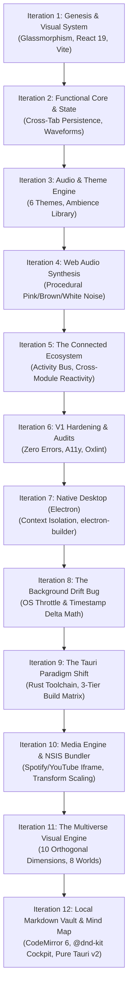

# 🛠️ AURA: From Concept to Binary
### *The Engineering Iteration Log of a Spec-Driven "Vibe Coded" Desktop Suite*

> *"Software built with AI isn't created in a single prompt on a random afternoon. Production-quality software emerges from relentless iteration, architectural trade-offs, edge-case debugging, and disciplined feedback loops between a human technical director and an AI pair programmer."*

This document chronicles the complete development journey of **AURA**, an industry-grade desktop productivity application built collaboratively by **Human Product Architect & Technical Director** (prompting, reviewing, testing, catching OS-level bugs) and **Gemini** (autonomous implementation, refactoring, systems engineering).

---



---

## 📅 Chronological Iteration Breakdown

### Iteration 1 — Genesis & Visual Architecture
* **The Directive**: Create a modern desktop productivity application featuring premium glassmorphism (frosted glass, fluid gradients, rounded corners, subtle animations, dark/light modes). Organize into distinct productivity modules.
* **Architecture Built**:
  - Initialized Vite + React 19 + TypeScript foundation.
  - Modular tab layout: Home Dashboard, Focus (Pomodoro), Tasks (Kanban), Notes (Markdown), Habits, Journal (Mood Tracker), Statistics, and Settings.
  - Established CSS variable design system (`--glass-bg`, `--glass-border`, `--accent-primary`).
  - Built initial state management using `zustand`.

---

### Iteration 2 — Functional Core & Audio Integration
* **The Review & Issues Identified**:
  - Local sound triggers failed.
  - Pomodoro timer reset whenever navigating between tabs.
  - Waveform visualizer missing in Focus mode.
  - Homepage lacked a calendar view.
* **Engineering Solutions**:
  - Refactored `useFocusStore` with Zustand persistence middleware so timer states survive tab switching.
  - Built an HTML5 Canvas audio visualizer computing live sine waves for focus state.
  - Integrated React Calendar and responsive daily overview cards into the Home Dashboard.

---

### Iteration 3 — Sound System Evolution & Theme Engine
* **The Directive**: Remove clunky local audio dependencies. Create an ambient music suite (Lo-fi, Rain, Coffee Shop, Fireplace, Ocean, Wind, Keyboard Clicks). Add at least 6 distinct visual themes, typography style options, and dynamic quotes.
* **Architecture Built**:
  - Implemented 6 full themes: `Glass (Default)`, `Ocean`, `Midnight`, `Sunset`, `Forest`, and `Minimalist`.
  - Added support for 4 typography presets: `Inter (Sans)`, `Roboto`, `Fira Code (Monospace)`, and `Merriweather (Serif)`.
  - Added Celsius/Fahrenheit temperature toggles and random motivational quotes on tab switch.

---

### Iteration 4 — Audio Realism & Web Audio API Synthesis
* **The Review & Issues Identified**:
  - Ambient sounds sounded artificial.
  - The user explicitly requested preserving raw noise bars (Brown, White, Pink noise) alongside ambient tracks.
  - Settings buttons (theme switching, dark/light mode, temperature units) experienced state desynchronization.
* **Engineering Solutions**:
  - Designed `audioEngine.ts` using the **Web Audio API** (`AudioContext`, `createScriptProcessor`, biquad filters) to generate **procedural, mathematical noise**:
    - **White Noise**: Uniform random Gaussian distribution.
    - **Pink Noise**: Paul Kellet's filtered algorithm for balanced 1/f falloff.
    - **Brownian (Red) Noise**: Leaky integrated random walk for deep, relaxing rumblings.
  - Fixed theme selector class bindings and localStorage synchronization.

---

### Iteration 5 — The Connected Ecosystem
* **The Directive**: Stop treating pages as isolated silos. When an action occurs anywhere in AURA, every relevant view must update automatically (completing a task updates Dashboard & Stats; completing a Pomodoro updates daily focus time and streaks; habit tracking feeds into daily productivity scoring).
* **Architecture Built**:
  - Built `useActivityStore`: a global event bus that logs timestamps, icons, and activity descriptions.
  - Created the **Recent Activity Timeline** widget on the Home Dashboard.
  - Added a dynamic **Productivity Score** algorithm weighting task completion, focus sessions, and habits into a live daily score.

---

### Iteration 6 — Release Candidate 1.0 Hardening
* **The Directive**: Do not introduce trendy bloat. Refine and audit AURA as a Senior Product Designer and Software Architect before public release.
* **Engineering Solutions**:
  - Complete Oxlint and TypeScript strict audits: zero errors, resolved all memory leaks and dangling listeners.
  - Synchronized all micro-interactions to a unified CSS timing variable (`--animation-duration: 200ms`).
  - Added keyboard shortcuts (`Ctrl+K` command palette, `Ctrl+Enter` task creation).
  - Implemented local JSON data backup export and import.

---

### Iteration 7 — Native Desktop Packaging (Electron)
* **The Directive**: Package AURA so the end user never needs to run `npm run dev` or open a browser. It must launch as a native Windows application.
* **Architecture Built**:
  - Configured `vite.config.ts` with relative asset resolution (`base: './'`).
  - Implemented Electron Main Process (`electron/main.js`) with secure context isolation (`nodeIntegration: false`, `contextIsolation: true`, `preload.js`).
  - Configured `electron-builder` with custom branding (`build/icon.png`), NSIS installer, and portable targets.

---

### Iteration 8 — The Background Timer Drift Bug
* **The Review & Real-World Bug**:
  - *Symptom*: When the user minimized AURA to take notes in Obsidian or write code, the Pomodoro timer severely lagged or paused. 25 minutes of real time only subtracted ~3 minutes on the timer.
* **Root-Cause Analysis**:
  - Modern operating systems and Chromium aggressively throttle background tab timers (`setInterval`) down to 1 tick per 10–60 seconds to preserve battery and CPU. Because the timer naively decremented `timeLeft - 1` per tick, it missed 90% of real time.
* **Engineering Solution**:
  - Completely refactored `useTimer.ts` from naive decrements to a **Timestamp Delta-Time Architecture**:
  ```typescript
  // When active, establish a timestamp anchor:
  endTimeRef.current = Date.now() + timeLeft * 1000;

  // On every tick (even if delayed 10s by the OS), calculate real elapsed time:
  const remaining = Math.max(0, Math.round((endTimeRef.current - Date.now()) / 1000));
  setTimeLeft(remaining);
  ```
  - Result: 100% clock accuracy regardless of OS background throttling or window minimization.

---

### Iteration 9 — The Tauri Paradigm Shift & Unified Build Matrix
* **The Question & Directive**: Electron worked, but bundled a 150MB Chromium instance and used excessive background RAM. Could we build a modern, ultra-lightweight alternative?
* **Architecture Built**:
  - Automated silent installation of the official **Rust toolchain** (`rustup` / `cargo`).
  - Initialized **Tauri v2** (`@tauri-apps/cli`, `src-tauri/`) using native Windows Edge WebView2.
  - Restructured the project into a clean **3-Tier Build Matrix**:
    - `Builds/Web/` → Static SPA.
    - `Builds/Electron/` → Chromium-wrapped executable (~150MB).
    - `Builds/Tauri/` → Rust-native executable (~5MB, instant startup, fraction of RAM).
  - Added unified npm scripts: `dist:web`, `dist:electron`, `dist:tauri`, and `dist:all`.

---

### Iteration 10 — Embedded Media Engine, UI Scaling & Installer Hardening
* **The Directive & Final Polish**:
  - Replace static ambience buttons with a flexible **Embedded Media Player** supporting custom YouTube and Spotify URLs (while keeping synthetic noises intact).
  - Fix typography CSS mappings and weather geolocation timeout.
  - Add an in-app **UI Scaling Slider** (80% to 150%).
  - Remove placeholder "Free Plan" text.
  - Package an installable NSIS `.exe` for Tauri.
* **Engineering Solutions & Hurdles Solved**:
  - **Embedded Media Player**: Built `EmbeddedMediaPlayer.tsx` with regex parsing for Spotify (tracks, albums, playlists) and YouTube video IDs into responsive, sandboxed iframes.
  - **Network Timeout in Tauri Bundler**: Tauri's NSIS packager timed out downloading `nsis-3.11.zip` over GitHub releases. Solved by downloading and caching the toolchain directly into `%LOCALAPPDATA%\tauri\`, allowing `makensis` to produce `AURA_0.1.0_x64-setup.exe`.
  - **UI Scaling Viewport Bug**: Initial CSS `zoom` caused layout clipping and empty whitespace margins on downscale. Replaced with mathematically compensated `transform: scale()` matrix anchored to top-left with dynamic proportional dimensions:
  ```typescript
  const scale = uiScale / 100;
  rootElement.style.transform = `scale(${scale})`;
  rootElement.style.transformOrigin = 'top left';
  rootElement.style.width = `${100 / scale}%`;
  rootElement.style.height = `${100 / scale}%`;
  ```

---

### Iteration 11 — The Multiverse Visual Engine & 10-Dimension Architectural Worldbuilding
* **The Directive & Vision**:
  - Move beyond shallow color-swapping themes. Build authentic, fully cohesive visual and tactile environments.
  - Implement 8 canonical theme worlds: Translucent Cockpit, Cyber-CLI 1984, Neo-Brutalist Studio, Editorial Broadsheet, Technical Blueprint, 8-Bit Arcade, Obsidian Monolith, and Zen Botanical.
* **Architecture Built**:
  - **10 Orthogonal Dimensions**: Formalized Concept & Atmosphere, 4-Tier Typography (Display, Body, Mono, Accent), Silhouette Geometry (0px chamfers to asymmetric pebbles), Borders & Linework, Shadows & Depth, Surfaces & Textures (CRT scanlines, millimeter grids, linen, Game Boy dot matrix), Spatial Density, Motion Dynamics (0ms steps to 400ms easing), Interaction Feedback (tactile buttons, phosphor blooms), and Telemetry.
  - **Theme-Adaptive Focus Telemetry**: Real-time ASCII bracket meters for Cyber-CLI, tactile segmented blocks for Neo-Brutalist, 8-bit heart/XP bars for Arcade, and caliper gauges for Blueprint.
  - **Live Specimen Matrix**: Built interactive visual specimen board in Settings to audit typography, button depression physics, and border styles.

---

### Iteration 12 — Local-First Markdown Vault, Mind Map Extension & Cockpit Polish
* **The Directive & Vision**:
  - Transform Notes into a true **Local-First, Zero-Telemetry Markdown Knowledge Vault** where standard `.md` files on the local filesystem are the single source of truth.
  - Add an interactive visual **Notes Mind Map Extension** with bi-directional synchronization.
  - Introduce **Live Drag-and-Drop Dashboard Customization** powered by `@dnd-kit`.
  - Decouple Focus Spaces workflow presets from visual themes, preserving the user's active theme world.
  - Complete transition to **Pure Tauri v2 Desktop Runtime**, purging legacy Electron code.
* **Engineering Solutions & Hurdles Solved**:
  - **Local Markdown Vault (`IVaultDriver`)**: Implemented clean driver abstraction with `TauriVaultDriver` for native desktop operation (hardware atomic staging writes via `.tmp` + atomic rename, defensive `.trash/` safety, and live Rust filesystem watching via `notify-debouncer-mini`) and `MemoryVaultDriver` for testing.
  - **CodeMirror 6 Tri-Mode Editor**: Reading, Source, and Split views featuring offline bundled KaTeX math formula rendering, interactive checklist checkboxes, and GFM raw HTML support with strict CSS layout containment.
  - **Interactive Mind Map Canvas**: Bi-directional outline parser translating headings and nested lists into dynamic SVG knowledge trees with collision-free radial hierarchy, fluid pan/zoom, and wiki-link deep navigation.
  - **Live Dashboard Customizer**: Reorderable widget matrix with `@dnd-kit`, individual module visibility toggles, and persistent workspace configurations.
  - **Weather Resilience**: In-memory caching (30m TTL), 1.5s network timeout for zero UI blocking, and silent offline fallback preventing unhandled exceptions.
  - **Timezone-Safe Date Calculations**: `toLocalDateString()` ensuring calendar alignments and streaks match local midnight accurately.

---

## 🏆 Key Takeaways from the Vibe Coding Process

1. **Human Direction Is Everything**: AI can write fast code, but only a human user notices that "rain doesn't sound like rain", that background timers drift in real-world multitasking, or that a 150MB Electron footprint is unacceptable for a background productivity tool.
2. **Architecture Matters Early**: Separating state into Zustand stores allowed AURA to transition from a browser tab into an Electron window, and then into a Rust/Tauri native binary with zero changes to business logic.
3. **Spec-Driven Prompts Win**: Iterative, specific problem statements beat vague "make it better" prompts every time.
